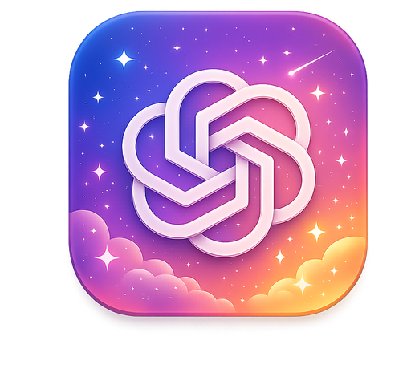

  
   
  <strong>GPT Themes</strong>
   

A small Windows-based skinner for ChatGPT Desktop that lets you customize the app with themes, colors, fonts, backgrounds, and glass effects. Choose built-in themes, adjust colors and transparency, select fonts, use images as backgrounds and apply visual skins while ChatGPT Desktop is running. This is an independent, unofficial customization tool. It is not affiliated with, endorsed by, sponsored by, or approved by OpenAI. ChatGPT and OpenAI are trademarks of OpenAI.  

  
    <strong>What it doesn't do:</strong> 
- Modify OpenAI servers 
- Replace the official ChatGPT app 
- Modify your ChatGPT account 
- Collect chats 
- Install executable theme plugins 
- Execute code from imported theme files 
   

<b>Appearance</b>

<table>
  <tr>
    <td><strong>Layout</strong></td>
    <td>Changes how wide the content area feels. Uses more horizontal space; default keeps the standard width.</td>
  </tr>
  <tr>
    <td><strong>Background</strong></td>
    <td>Sets the main background. Choose a base color, pattern, or local image.</td>
  </tr>
  <tr>
    <td><strong>Panel</strong></td>
    <td>Styles sidebars, menus, and panel areas. Choose a base color or a local image.</td>
  </tr>
</table>

<b>Security/Privacy</b>: GPT Themes customizes ChatGPT Desktop using a local Chromium debugging connection, which is currently required because there is no official theming API. GPT Themes uses a local debugging port, typically: `127.0.0.1:9322` to communicate with ChatGPT Desktop.

- Keep the debugging address bound to <code>127.0.0.1</code> 
- Don't change it to <code>0.0.0.0</code> 
- Don't expose the port to other machines or port-forward it. 
- Don't expose the port over LAN/VPN/container bridges/or remote access tools. 

<b>Does GPT Themes permanently modify ChatGPT Desktop?</b>  
No. Themes applies styles while ChatGPT is running: You can clear the skin/return it to normal when you close ChatGPT. 
<b>Is this an official OpenAI tool?</b> 
No. This is a small independent/unofficial project that is not affiliated with, endorsed by, sponsored by, or approved by OpenAI. 
<b>Why did you make this?</b> 
Because I hated the current lack of choices in ChatGPT Desktop, so I figured other people might also. 
<b>Was this created with AI?</b> 
Yes, this is technically slop as I learn to play with LLM's.  

  
    
    Created by <a href="https://www.piratemoo.com">piratemoo</a> - 2026  
 

